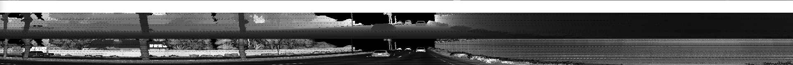
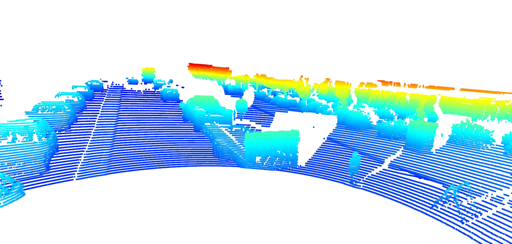
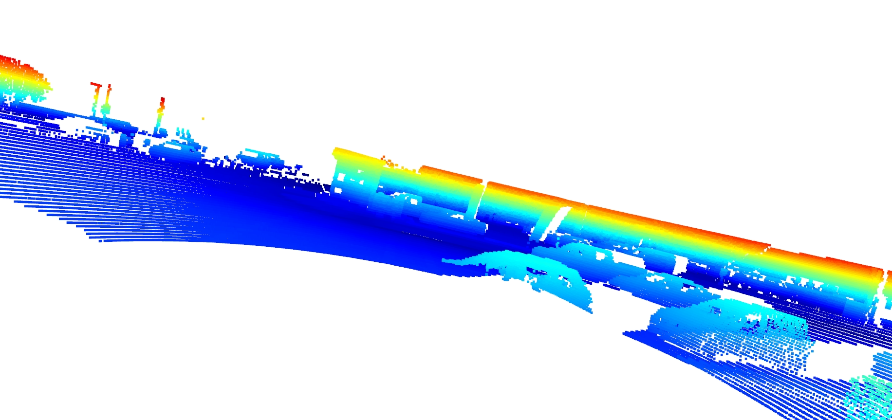
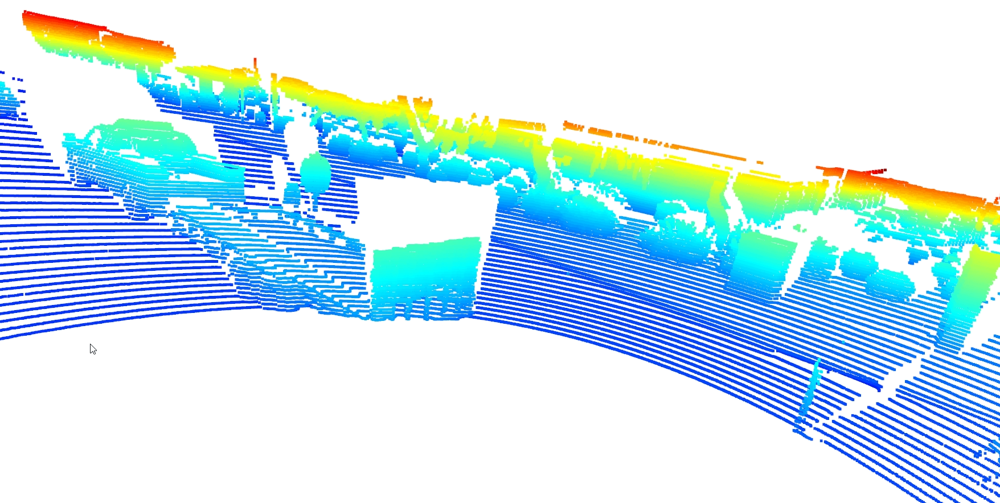
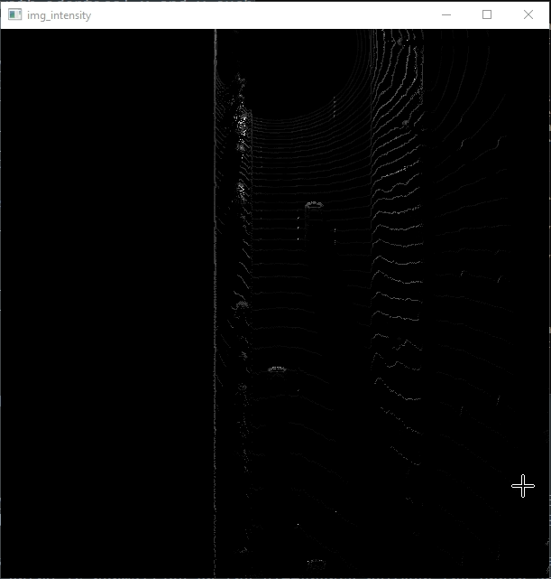
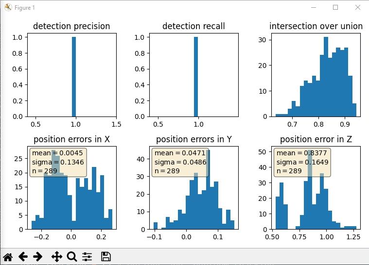

# SDCND : Sensor Fusion and Tracking
This is the project for the second course in the  [Udacity Self-Driving Car Engineer Nanodegree Program](https://www.udacity.com/course/c-plus-plus-nanodegree--nd213) : Sensor Fusion and Tracking. 

In this project, you'll fuse measurements from LiDAR and camera and track vehicles over time. You will be using real-world data from the Waymo Open Dataset, detect objects in 3D point clouds and apply an extended Kalman filter for sensor fusion and tracking.


The project consists of two major parts: 
1. **Object detection**: In this part, a deep-learning approach is used to detect vehicles in LiDAR data based on a birds-eye view perspective of the 3D point-cloud. Also, a series of performance measures is used to evaluate the performance of the detection approach. 
2. **Object tracking** : In this part, an extended Kalman filter is used to track vehicles over time, based on the lidar detections fused with camera detections. Data association and track management are implemented as well.

The following diagram contains an outline of the data flow and of the individual steps that make up the algorithm. 


Also, the project code contains various tasks, which are detailed step-by-step in the code. More information on the algorithm and on the tasks can be found in the Udacity classroom. 

## Project File Structure

📦project<br>
 ┣ 📂dataset --> contains the Waymo Open Dataset sequences <br>
 ┃<br>
 ┣ 📂misc<br>
 ┃ ┣ evaluation.py --> plot functions for tracking visualization and RMSE calculation<br>
 ┃ ┣ helpers.py --> misc. helper functions, e.g. for loading / saving binary files<br>
 ┃ ┗ objdet_tools.py --> object detection functions without student tasks<br>
 ┃ ┗ params.py --> parameter file for the tracking part<br>
 ┃ <br>
 ┣ 📂results --> binary files with pre-computed intermediate results<br>
 ┃ <br>
 ┣ 📂student <br>
 ┃ ┣ association.py --> data association logic for assigning measurements to tracks incl. student tasks <br>
 ┃ ┣ filter.py --> extended Kalman filter implementation incl. student tasks <br>
 ┃ ┣ measurements.py --> sensor and measurement classes for camera and lidar incl. student tasks <br>
 ┃ ┣ objdet_detect.py --> model-based object detection incl. student tasks <br>
 ┃ ┣ objdet_eval.py --> performance assessment for object detection incl. student tasks <br>
 ┃ ┣ objdet_pcl.py --> point-cloud functions, e.g. for birds-eye view incl. student tasks <br>
 ┃ ┗ trackmanagement.py --> track and track management classes incl. student tasks  <br>
 ┃ <br>
 ┣ 📂tools --> external tools<br>
 ┃ ┣ 📂objdet_models --> models for object detection<br>
 ┃ ┃ ┃<br>
 ┃ ┃ ┣ 📂darknet<br>
 ┃ ┃ ┃ ┣ 📂config<br>
 ┃ ┃ ┃ ┣ 📂models --> darknet / yolo model class and tools<br>
 ┃ ┃ ┃ ┣ 📂pretrained --> copy pre-trained model file here<br>
 ┃ ┃ ┃ ┃ ┗ complex_yolov4_mse_loss.pth<br>
 ┃ ┃ ┃ ┣ 📂utils --> various helper functions<br>
 ┃ ┃ ┃<br>
 ┃ ┃ ┗ 📂resnet<br>
 ┃ ┃ ┃ ┣ 📂models --> fpn_resnet model class and tools<br>
 ┃ ┃ ┃ ┣ 📂pretrained --> copy pre-trained model file here <br>
 ┃ ┃ ┃ ┃ ┗ fpn_resnet_18_epoch_300.pth <br>
 ┃ ┃ ┃ ┣ 📂utils --> various helper functions<br>
 ┃ ┃ ┃<br>
 ┃ ┗ 📂waymo_reader --> functions for light-weight loading of Waymo sequences<br>
 ┃<br>
 ┣ basic_loop.py<br>
 ┣ loop_over_dataset.py<br>


## Installation Instructions for Running Locally
### Cloning the Project
In order to create a local copy of the project, please click on "Code" and then "Download ZIP". Alternatively, you may of-course use GitHub Desktop or Git Bash for this purpose. 

### Python
The project has been written using Python 3.7. Please make sure that your local installation is equal or above this version. 

### Package Requirements
All dependencies required for the project have been listed in the file `requirements.txt`. You may either install them one-by-one using pip or you can use the following command to install them all at once: 
`pip3 install -r requirements.txt` 

### Waymo Open Dataset Reader
The Waymo Open Dataset Reader is a very convenient toolbox that allows you to access sequences from the Waymo Open Dataset without the need of installing all of the heavy-weight dependencies that come along with the official toolbox. The installation instructions can be found in `tools/waymo_reader/README.md`. 

### Waymo Open Dataset Files
This project makes use of three different sequences to illustrate the concepts of object detection and tracking. These are: 
- Sequence 1 : `training_segment-1005081002024129653_5313_150_5333_150_with_camera_labels.tfrecord`
- Sequence 2 : `training_segment-10072231702153043603_5725_000_5745_000_with_camera_labels.tfrecord`
- Sequence 3 : `training_segment-10963653239323173269_1924_000_1944_000_with_camera_labels.tfrecord`

To download these files, you will have to register with Waymo Open Dataset first: [Open Dataset – Waymo](https://waymo.com/open/terms), if you have not already, making sure to note "Udacity" as your institution.

Once you have done so, please [click here](https://console.cloud.google.com/storage/browser/waymo_open_dataset_v_1_2_0_individual_files) to access the Google Cloud Container that holds all the sequences. Once you have been cleared for access by Waymo (which might take up to 48 hours), you can download the individual sequences. 

The sequences listed above can be found in the folder "training". Please download them and put the `tfrecord`-files into the `dataset` folder of this project.


### Pre-Trained Models
The object detection methods used in this project use pre-trained models which have been provided by the original authors. They can be downloaded [here](https://drive.google.com/file/d/1Pqx7sShlqKSGmvshTYbNDcUEYyZwfn3A/view?usp=sharing) (darknet) and [here](https://drive.google.com/file/d/1RcEfUIF1pzDZco8PJkZ10OL-wLL2usEj/view?usp=sharing) (fpn_resnet). Once downloaded, please copy the model files into the paths `/tools/objdet_models/darknet/pretrained` and `/tools/objdet_models/fpn_resnet/pretrained` respectively.

### Using Pre-Computed Results

In the main file `loop_over_dataset.py`, you can choose which steps of the algorithm should be executed. If you want to call a specific function, you simply need to add the corresponding string literal to one of the following lists: 

- `exec_data` : controls the execution of steps related to sensor data. 
  - `pcl_from_rangeimage` transforms the Waymo Open Data range image into a 3D point-cloud
  - `load_image` returns the image of the front camera

- `exec_detection` : controls which steps of model-based 3D object detection are performed
  - `bev_from_pcl` transforms the point-cloud into a fixed-size birds-eye view perspective
  - `detect_objects` executes the actual detection and returns a set of objects (only vehicles) 
  - `validate_object_labels` decides which ground-truth labels should be considered (e.g. based on difficulty or visibility)
  - `measure_detection_performance` contains methods to evaluate detection performance for a single frame

In case you do not include a specific step into the list, pre-computed binary files will be loaded instead. This enables you to run the algorithm and look at the results even without having implemented anything yet. The pre-computed results for the mid-term project need to be loaded using [this](https://drive.google.com/drive/folders/1-s46dKSrtx8rrNwnObGbly2nO3i4D7r7?usp=sharing) link. Please use the folder `darknet` first. Unzip the file within and put its content into the folder `results`.

- `exec_tracking` : controls the execution of the object tracking algorithm

- `exec_visualization` : controls the visualization of results
  - `show_range_image` displays two LiDAR range image channels (range and intensity)
  - `show_labels_in_image` projects ground-truth boxes into the front camera image
  - `show_objects_and_labels_in_bev` projects detected objects and label boxes into the birds-eye view
  - `show_objects_in_bev_labels_in_camera` displays a stacked view with labels inside the camera image on top and the birds-eye view with detected objects on the bottom
  - `show_tracks` displays the tracking results
  - `show_detection_performance` displays the performance evaluation based on all detected 
  - `make_tracking_movie` renders an output movie of the object tracking results

Even without solving any of the tasks, the project code can be executed. 

The final project uses pre-computed lidar detections in order for all students to have the same input data. If you use the workspace, the data is prepared there already. Otherwise, [download the pre-computed lidar detections](https://drive.google.com/drive/folders/1IkqFGYTF6Fh_d8J3UjQOSNJ2V42UDZpO?usp=sharing) (~1 GB), unzip them and put them in the folder `results`.

## External Dependencies
Parts of this project are based on the following repositories: 
- [Simple Waymo Open Dataset Reader](https://github.com/gdlg/simple-waymo-open-dataset-reader)
- [Super Fast and Accurate 3D Object Detection based on 3D LiDAR Point Clouds](https://github.com/maudzung/SFA3D)
- [Complex-YOLO: Real-time 3D Object Detection on Point Clouds](https://github.com/maudzung/Complex-YOLOv4-Pytorch)


## License
[License](LICENSE.md)

# Writeup: Track 3D-Objects Over Time


## Step 1: Compute Lidar Point-Cloud from Range Image

### Task 1: Visualize range image channels (ID_S1_EX1)
**Task preparations**

In the file ```loop_over_dataset.py``` we uptate the following parameters:

- ```data_filename = 'training_segment-1005081002024129653_5313_150_5333_150_with_camera_labels.tfrecord```
- ``` show_only_frames = [0, 1] ```
- ```exec_data = []```
- ```exec_detection = []```
- ```exec_tracking =[]```
- ```exec_visualization = ['show_range_image']```


in the function ```show_range_image``` lcated in the file ```student/objdet_pcl.py```
the input is ```frame``` and ```lidar_name```, we extracted the lidar data from the frame and extracted the range image and converted to ```8-bit``` scale.
In addition we used ```np.vstack``` to stack the range and intensity.

**results**
<figure>
<figcaption>Rang Image</figcaption>
<figure>

### Task 2: Visualize lidar point-cloud (ID_S1_EX2)
in the file ```loop_over_dataset.py``` we uptate the following parameters:
- ``` show_only_frames = [0, 200] ```
- ```exec_visualization = ['show_pcl']```

in the function ```show_pcl``` at ``` student/objdet_pcl.py``` we implement the following:
we initialize th open3d and greated the instace of open3d point-cloud then we convertied the point-cloud into 3d
and we got the following result for point cloud visualization in varying degrees of visibility:
**Image 1**

**Image 2**

**Image 3**

**Image 4**

**Image 5**

**Image 6**
    
    
## Step 2: Create Birds-Eye View from Lidar PCL
### Task 1: Convert sensor coordinates to BEV-map coordinates (ID_S2_EX1)
In the file ```loop_over_dataset.py``` we uptate the following parameters:

- ```data_filename = 'training_segment-1005081002024129653_5313_150_5333_150_with_camera_labels.tfrecord```
- ``` show_only_frames = [0, 1] ```
- ```exec_data = ['pcl_from_rangeimage']```
- ```exec_detection = ['bev_from_pcl']```
- ```exec_tracking =[]```
- ```exec_visualization = []```

in the function ```bev_from_pcl``` at ``` student/objdet_pcl.py``` we implement the following:

we copy of the lidar pcl and transform all metrix into bev-image corrdinates.
according to config cretaria, we use this parameters:
    


    
And we get the following result:
<figure>
<figcaption>visualization into BEV map coordinates</figcaption>
<figure>    

### Task 2: Compute intensity layer of the BEV map (ID_S2_EX2)
In the file ```loop_over_dataset.py``` we utilize the same prevouse parametrs.
in the function ```bev_from_pcl``` at ``` student/objdet_pcl.py```, we re-arranged the elements in lidar by sorting x,y, and -z respectively.
Using ```numpy.unique``` then we assign the intensity value of each unique entry in lidar_top_pcl to the intensity map.
Finally we converted the results to image using OpenCv and we got this results.

**Image intensity**

### Task 3: Compute height layer of the BEV map (ID_S2_EX3)
In this task, we also used same parameters in ```Task 2``` 
in the function ```bev_from_pcl``` at ``` student/objdet_pcl.py```, we assigned the height value of each unique entry in lidar_top_pcl to the height map and normalized the defference between the upper and lower height as defined in the config file ```configs.lim_z```
and we get the following result:

**height map**
## Step 3: Model-based Object Detection in BEV Image (ID_S3_EX1) and (ID_S§_EX2)
In the file ```loop_over_dataset.py``` we uptate the following parameters:
- ```show_only_frames = [50, 51]```
- ```exec_data = ['pcl_from_rangeimage', 'load_image']```
- ```exec_detection = ['bev_from_pcl', 'detect_objects']```
- ```exec_visualization = ['show_objects_in_bev_labels_in_camera']```
- ```configs_det = det.load_configs(model_name="fpn_resnet")```
    
    
Firstly, we clone the repository github project  [Super Fast and Accurate 3D Object Detection based on 3D LiDAR Point Clouds](https://github.com/maudzung/SFA3D), then we extracted relevant parameters form the project to put a configs lstructurs at the file ```student/detect_objects.py```at the function ```creat_model```
    
Then in the file ```student/objdet_detect.py``` we integrated the three channel BVE and the images to produce 3D object Detection.
    
The result appeard as following imag:

**3D bounding boxes added to the images**
    
## Step 4: Performance Evaluation for Object Detection
### Compute precision and recall (ID_S4_EX3)
In the file ```loop_over_dataset.py``` we uptate the following parameters:
- ```show_only_frames = [50, 150]```
- ```exec_data = ['pcl_from_rangeimage']```
- ```exec_detection = ['bev_from_pcl', 'detect_objects','validate_object_labels', 'measure_detection_performance']```
- ```exec_visualization = ['show_detection_performance']```
- ```configs_det = det.load_configs(model_name="darknet")```

we implement the following steps:

- Compute intersection-over-union between labels and detections (ID_S4_EX1)
- computed the false negatives and false positives (ID_S4_EX2)
- deleted the Iou and kept the maximum confidence if the Iou over the threshold (in our work we used Iou=0.5).
- comput the precition and recall and plot the results as following:

 
**precision recall curve is plot**


**precition and recall over images from 50 to 150**
    
In the prevouse result we use model-based detection    
If we update the config parameter ```configs_det.use_labels_as_objects = True```, we will get the perfect result because we utilized the groundtruth labels and we will get the following result:


## Summary
In this project, we concluded that LiDAR could be efficient in improving perception by integrating it with images for 3D object detection.

The challenge with the sensors arises in severe weather conditions, where autonomous driving systems face numerous difficulties.

Additionally, we could enhance the results by updating the thresholds, such as IOU and Confidence, or by using other algorithms like YOLOv5 or YOLOv8.

**The Most Difficult Aspects** of this project involve utilizing the LiDAR channels, which have different pressure compared to the image channels.
