# Writeup: Track 3D-Objects Over Time


## Step 1: Compute Lidar Point-Cloud from Range Image

### Task 1: Visualize range image channels (ID_S1_EX1)
**Task preparations**

In the file ```loop_over_dataset.py``` we uptate the following parameters:

- ```data_filename = 'training_segment-1005081002024129653_5313_150_5333_150_with_camera_labels.tfrecord```
- ``` show_only_frames = [0, 1] ```
- ```exec_data = []```
- ```exec_detection = []```
- ```exec_tracking =[]```
- ```exec_visualization = ['show_range_image']```


in the function ```show_range_image``` lcated in the file ```student/objdet_pcl.py```
the input is ```frame``` and ```lidar_name```, we extracted the lidar data from the frame and extracted the range image and converted to ```8-bit``` scale.
In addition we used ```np.vstack``` to stack the range and intensity.

**results**
<figure>
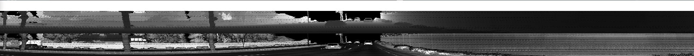<figcaption>Rang Image</figcaption>
<figure>

### Task 2: Visualize lidar point-cloud (ID_S1_EX2)
in the file ```loop_over_dataset.py``` we uptate the following parameters:
- ``` show_only_frames = [0, 200] ```
- ```exec_visualization = ['show_pcl']```

in the function ```show_pcl``` at ``` student/objdet_pcl.py``` we implement the following:
we initialize th open3d and greated the instace of open3d point-cloud then we convertied the point-cloud into 3d
and we got the following result for point cloud visualization in varying degrees of visibility:
**Image 1**
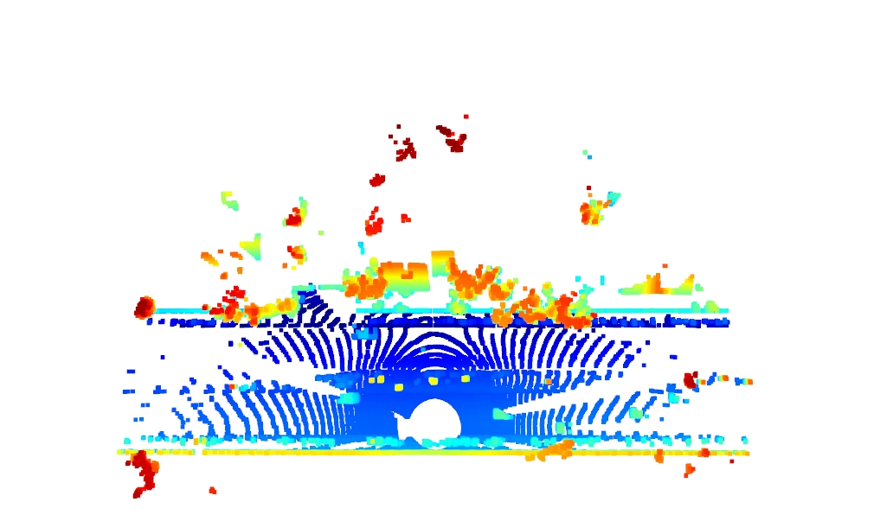
**Image 2**
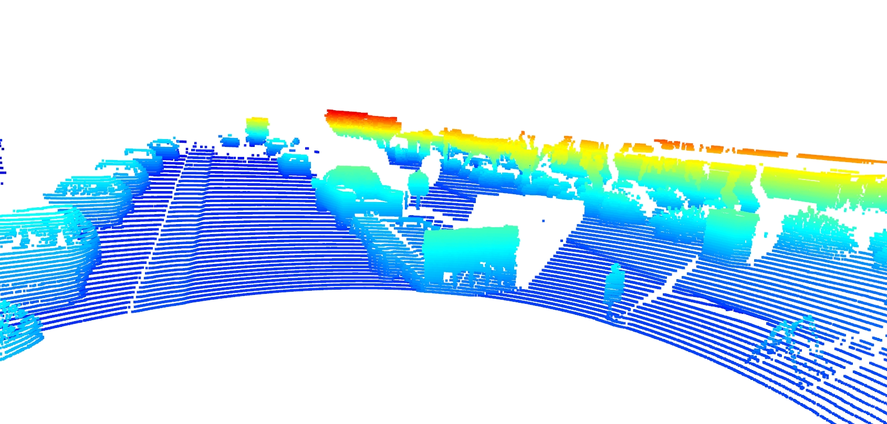
**Image 3**
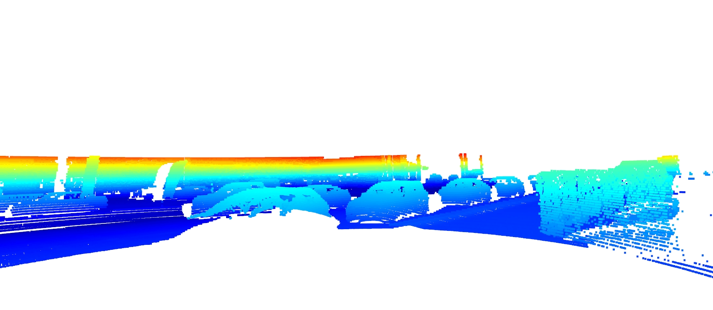
**Image 4**

**Image 5**
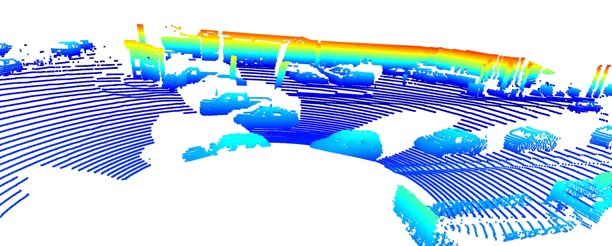
**Image 6**
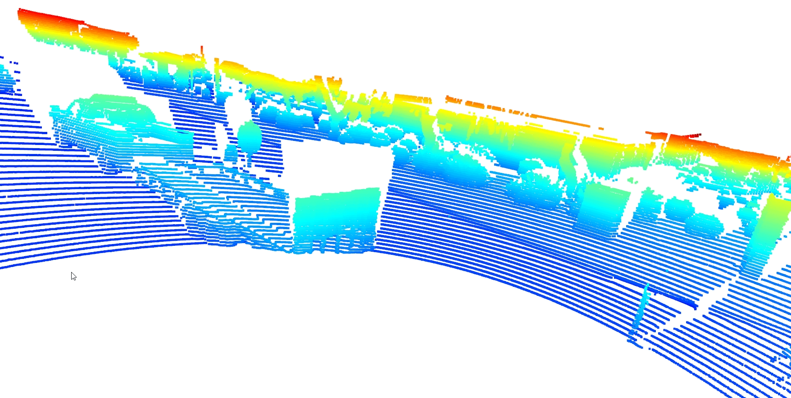    
    
## Step 2: Create Birds-Eye View from Lidar PCL
### Task 1: Convert sensor coordinates to BEV-map coordinates (ID_S2_EX1)
In the file ```loop_over_dataset.py``` we uptate the following parameters:

- ```data_filename = 'training_segment-1005081002024129653_5313_150_5333_150_with_camera_labels.tfrecord```
- ``` show_only_frames = [0, 1] ```
- ```exec_data = ['pcl_from_rangeimage']```
- ```exec_detection = ['bev_from_pcl']```
- ```exec_tracking =[]```
- ```exec_visualization = []```

in the function ```bev_from_pcl``` at ``` student/objdet_pcl.py``` we implement the following:

we copy of the lidar pcl and transform all metrix into bev-image corrdinates.
according to config cretaria, we use this parameters:
    


    
And we get the following result:
<figure>
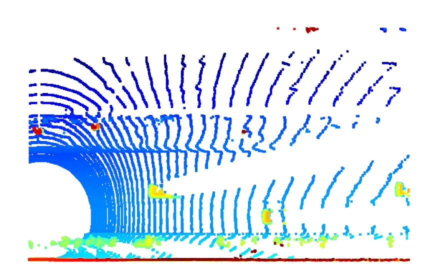<figcaption>visualization into BEV map coordinates</figcaption>
<figure>    

### Task 2: Compute intensity layer of the BEV map (ID_S2_EX2)
In the file ```loop_over_dataset.py``` we utilize the same prevouse parametrs.
in the function ```bev_from_pcl``` at ``` student/objdet_pcl.py```, we re-arranged the elements in lidar by sorting x,y, and -z respectively.
Using ```numpy.unique``` then we assign the intensity value of each unique entry in lidar_top_pcl to the intensity map.
Finally we converted the results to image using OpenCv and we got this results.
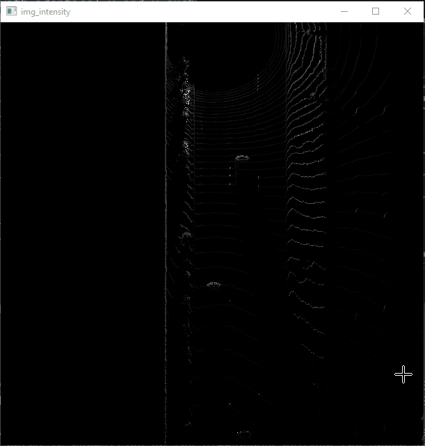
**Image intensity**

### Task 3: Compute height layer of the BEV map (ID_S2_EX3)
In this task, we also used same parameters in ```Task 2``` 
in the function ```bev_from_pcl``` at ``` student/objdet_pcl.py```, we assigned the height value of each unique entry in lidar_top_pcl to the height map and normalized the defference between the upper and lower height as defined in the config file ```configs.lim_z```
and we get the following result:
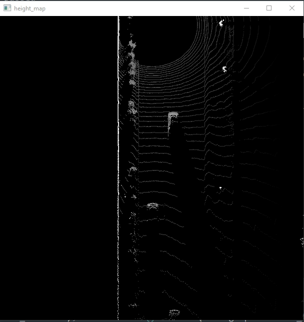
**height map**
## Step 3: Model-based Object Detection in BEV Image (ID_S3_EX1) and (ID_S§_EX2)
In the file ```loop_over_dataset.py``` we uptate the following parameters:
- ```show_only_frames = [50, 51]```
- ```exec_data = ['pcl_from_rangeimage', 'load_image']```
- ```exec_detection = ['bev_from_pcl', 'detect_objects']```
- ```exec_visualization = ['show_objects_in_bev_labels_in_camera']```
- ```configs_det = det.load_configs(model_name="fpn_resnet")```
    
    
Firstly, we clone the repository github project  [Super Fast and Accurate 3D Object Detection based on 3D LiDAR Point Clouds](https://github.com/maudzung/SFA3D), then we extracted relevant parameters form the project to put a configs lstructurs at the file ```student/detect_objects.py```at the function ```creat_model```
    
Then in the file ```student/objdet_detect.py``` we integrated the three channel BVE and the images to produce 3D object Detection.
    
The result appeard as following imag:
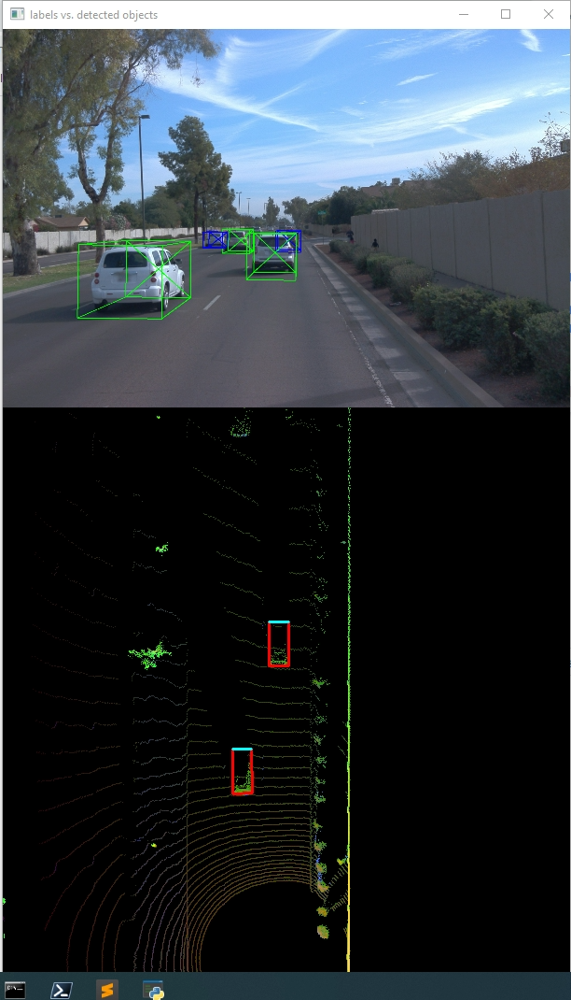
**3D bounding boxes added to the images**
    
## Step 4: Performance Evaluation for Object Detection
### Compute precision and recall (ID_S4_EX3)
In the file ```loop_over_dataset.py``` we uptate the following parameters:
- ```show_only_frames = [50, 150]```
- ```exec_data = ['pcl_from_rangeimage']```
- ```exec_detection = ['bev_from_pcl', 'detect_objects','validate_object_labels', 'measure_detection_performance']```
- ```exec_visualization = ['show_detection_performance']```
- ```configs_det = det.load_configs(model_name="darknet")```

we implement the following steps:

- Compute intersection-over-union between labels and detections (ID_S4_EX1)
- computed the false negatives and false positives (ID_S4_EX2)
- deleted the Iou and kept the maximum confidence if the Iou over the threshold (in our work we used Iou=0.5).
- comput the precition and recall and plot the results as following:
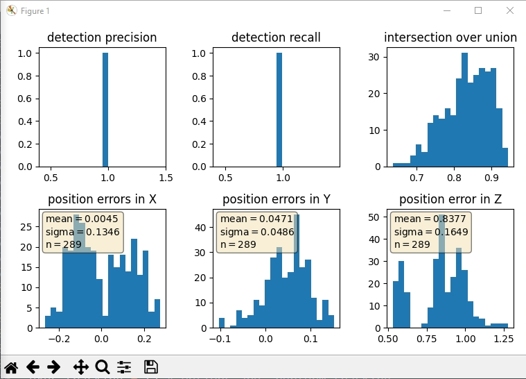
 
**precision recall curve is plot**
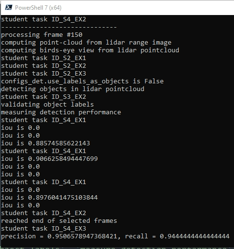
**precition and recall over images from 50 to 150**
    
In the prevouse result we used a model-based detection    
If we update the config parameter ```configs_det.use_labels_as_objects = True```, we will get the perfect result because we utilized the groundtruth labels and we will get the following result:
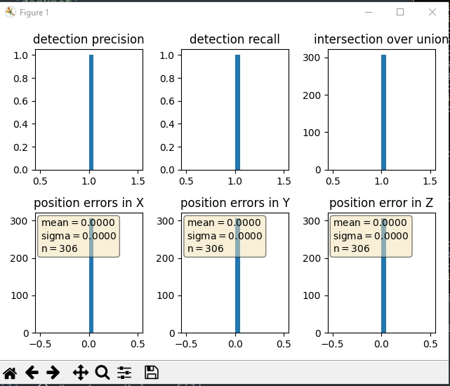

## Summary
In this project, we concluded that LiDAR could be efficient in improving perception by integrating it with images for 3D object detection.

The challenge with the sensors arises in severe weather conditions, where autonomous driving systems face numerous difficulties.

Additionally, we could enhance the results by updating the thresholds, such as IOU and Confidence, or by using other algorithms like YOLOv5 or YOLOv8.

**The Most Difficult Aspects** of this project involve utilizing the LiDAR channels, which have different pressure compared to the image channels.
